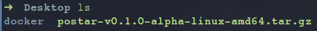
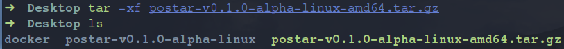
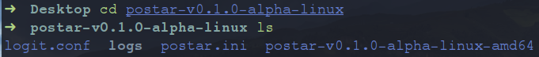
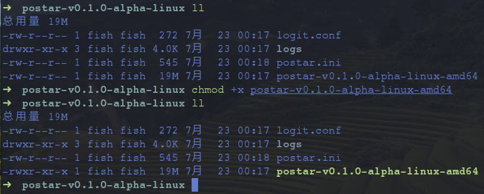
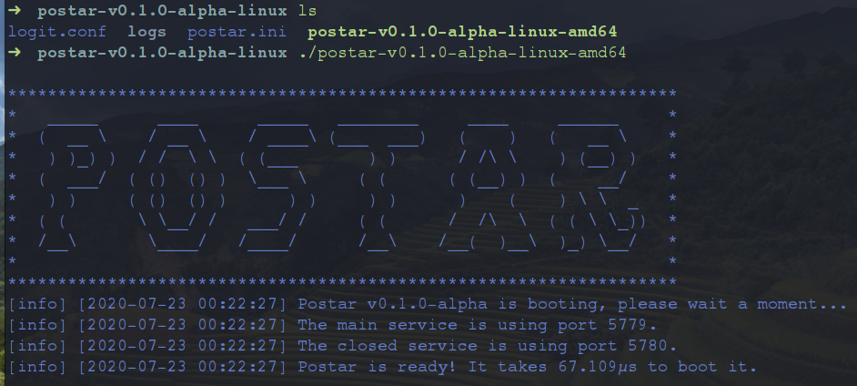

### Linux and Mac Installation Manual

1. Go to releases and download one version that you want to install.

_Use version v0.1.1-alpha and Linux as an example._
_Linux's users choose linux, and Mac's users choose darwin._

2. Unzip the package to the target directory.

3. Open this directory, and you will see some files, the main file is the executable file.

_logs: the directory stores all logs._

_logit.conf: the config file of logger. Check logit's documents to know more usages._

_postar.ini: the main config file of postar. Check **_examples/config** to know more usages._

_postar-xxx.exe: the executable binary file._

4. Before starting postar, you should finish some settings in postar.ini.

_If you don't know how to set, get some helps from your smtp service._

_Maybe the executable binary file doesn't have competence, so you can use chmod to have._

5. Execute the executable binary file, and you will see the welcome interface.

6. Enjoy it!
